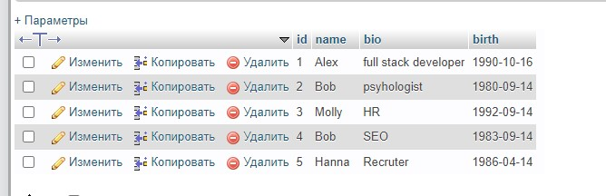
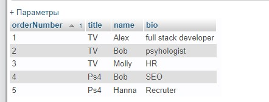

Содержание

- [Что такое SQL](#что-такое-sql)

- [Установка менеджера](#установка-менеджера)

- [Установка локального сервера](#установка-локального-сервера)

- [Практика с SQL](#практика-с-sql)

- [Создание таблицы с полями](#создание-таблицы-с-полями)
- [Заполнение полей данными](#заполнение-полей-данными)

- [Обновление данных](#обновление-данных)

- [Удаление данных](#удаление-данных)

- [Выборка данных из БД](#выборка-данных-из-бд)

- [Связывание таблиц](#связывание-таблиц)

  1. [SELECT](#select)
  2. [DISTINCT](#distinct)
  3. [LIMIT](#limit)
  4. [ORDER BY](#order-by)
  5. [BETWEEN / IN / LIKE](#BETWEEN-/-IN-/-LIKE)

- [Работа с индексами](#работа-с-индексами)
  1. [Объединение с помощью INNER JOIN](#Объединение-с-помощью-INNER-JOIN)
  2. [Объединение с помощью LEFT JOIN/RIGTH JOIN](#Объединение-с-помощью-LEFT-JOIN/RIGTH-JOIN)

## Что такое SQL

SQL (structured query language) - язык структурированных запросов, предназначенный для обращения к базе данных.

## Установка менеджера

Eсть множества менеджеров, предоставляющих удобные графические интерфейсы для работы с SQL. Здесь будет использоваться программа [PHPMyAdmin](https://www.phpmyadmin.net/).

_Примечание: можно выбрать любой другой менеджер для работы с SQL, синтаксис языка будет таким же_

## Установка локального сервера

Для работы с SQL можно использовать локальный или удаленный сервер. Для работы с локальным сервером потребуется одна из программ:

- [XAMPP](https://www.apachefriends.org/ru/index.html) (поддержка Linux)
- [OpenServer](https://ospanel.io/)
- [MAMP](https://www.mamp.info/en/)

Далее будет использоваться локальный сервер **MAMP**.

- net start sql
- net stop sql

## Практика с SQL

Создание и удаление базы данных:

- `CREATE DATABASE [name]`
- `DROP DATABASE [name]`

### Создание таблицы с полями

```
CREATE TABLE users (
	id INT NOT NULL AUTO_INCREMENT,
    PRIMARY KEY (id),
    name VARCHAR(30),
    bio TEXT,
    birth DATE
)
```

`NOT NULL` - поле id не может быть пустым;
`AUTO-INCREMENT`- каждый раз увеличивает значение id на 1;
`PRIMARY KEY (id)` - гарантирует уникальность значений для поля `id`;
`name VARCHAR(30)` - добавит поле name с длиной строки до 30 символов;
`bio TEXT` - создаст строковое поле bio любой длины (дог 65,353 символов)
`birth DATE` - поле birth с типом DATE (дата)

**Добавление нового поля в уже существующую таблицу:**

`ALTER TABLE users ADD email VARCHAR(32);`

**Удаление поля:** - `ALTER TABLE users DROP COLUMN email`

**Удаление всей таблицы** - `DROP TABLE users` -

### Заполнение полей данными

Сейчас есть БД users, которая содержит поля id, name, bio и birth. Заполнить эти поля значениями можно так:

```
INSERT INTO users (name, bio, birth) VALUES('Alex', 'Programmer', '1990-10-16')

// указывать все поля необязательно, на неуказанные вернет NULL
```

Можно сразу добавить несколько VALUES:

```
INSERT INTO users (name, bio, birth)
    VALUES
	('Alex', 'Psihologyst', '60-10-16'),
	('Molly', 'SEO', '53-10-16');

```

Также можно изменять настройки полей. Сделаем так, чтобы поле birth было обязательным, т.е. никогда не было `NULL`:

```
 ALTER TABLE users CHANGE birth birth DATE NOT NULL
```

Теперь если попробовать перейти в таблицу и добавить нового юзера, не заполнив поле birth, получим ошибку.

```
INSERT INTO users (name, bio, birth) VALUES('Alex', 'Programmer', '1990-10-16')

// Ответ MySQL: Field 'birth' doesn't have a default value
```

### Обновление данных

Можно обновить значения в таблице:

`UPDATE users SET `name` = 'Max' WHERE id = 5`

Это можно интерпретировать как "обновить (`UPDATE`) таблицу users, а именно - записать (`SET`) в поле `name` значение `Max` для записи, где (`WHERE`) id = 5"

### Удаление данных

Удаление данных делается схожим образом с обновлением данных.
Для примера создадим таблицу test с полями `id`, `someText`, `someField`.

```
CREATE TABLE test (
	id INT NOT NULL,
    PRIMARY KEY (id),
    someText TEXT,
   	someField VARCHAR(20)
);
```

Заполним ее данными:

```
INSERT INTO test (id, someText, someField)
	VALUES('1', 'Test text 1', 'Test field 1'),
    	  ('2', 'Test text 2', 'Test field 2'),
    	  ('3', 'Test text 3', 'Test field 3');
```

Удаление:

`DELETE FROM test WHERE id = 3` - удалит запись с `id = 3`

`DELETE FROM test` - удалит **ВСЕ** записи из таблицы.
`TRUNCATE test` - также удалит **ВСЕ** записи. Именно `TRUNCATE` обычно используется для очистки таблиц.

### Выборка данных из БД

#### Select

`SELECT * FROM users` - получить все данные из таблицы

`SELECT name, bio FROM users` - получить значения полей `name` и `bio`.

`SELECT id, name FROM users WHERE id > 2 AND id < 5` - выведет `id` и `name`, где id больше 2 и меньше 5

`SELECT name, birth from users WHERE name = "Alex"` - выведет имя и дату рождения юзера с именем **Alex**

`SELECT * FROM users WHERE id <> 2 AND id<> 3` - выберет все записи, где id **НЕ РАВНО** (`<>`) 2 и (`AND`) 3.

Количество условия с оператором `AND` может быть сколько угодно.
Также можно использовать операторы больше или равно (`>=`) и меньше или равно `<=`.

Помимо оператора **И** (`AND`), выборки данных можно создавать с помощью опернатора **ИЛИ** (`OR`)

`SELECT * FROM users WHERE bio="HR" OR bio="SEO"` - вернет все значения из таблицы `users`, у которых поле `bio = 'HR'` или (`OR`) `SEO`.

_Примечание: операторы `AND` и `OR` называются предиктами. На языке `SQL` так называются операции, которые возвращают `TRUE` или `FALSE`_.

#### DISTINCT

Оператор DISTINCT указывает, что следует работать только с уникальными значениями столбца.

Следующая команда вернет только уникальные имена из таблицы `users`, _т.е. если одно имя встречается более 1 раза, оно не продублируется в выводе_:

`SELECT DISTINCT name from users`.

#### LIMIT

Оператор `LIMIT` позволяет вывести указанное число строк из Всегда записывается в конце запроса.

`SELECT * FROM users LIMIT 2` - вернет первые 2 записи из таблицы `users`

`SELECT * FROM users LIMIT 0, 2` - вернет записи, начиная с первой(`0` - **пропустить 0 строк**) и заканчивая второрой (`2` - **вывести 2 строки**)

#### ORDER BY

Оператор **ORDER BY** предназначен для сортировки выводимых значений. Примеры:

`SELECT * FROM users ORDER BY name` - отсортирует записи по алфавиту (для чисел - по возрастанию) на основе значений поля `name`.

`SELECT * FROM users ORDER BY birth DESC` - так остортирует по дате рождения по обыванию (за это отвечает оператор `DESC`)

`SELECT name, birth FROM users WHERE name <> 'Bob' ORDER BY birth LIMIT 2` - выберет первые две записи из таблицы `users` со столбцами `name` и `birth` и отсортирует их по дате рождения.

_Примечание: порядок записи важен. Значала идет стандартная выборка (`SELECT... FROM...`), далее условие вывода (`WHERE`), потом сортировка (`ORDER BY`) и в конце лимт выводы(`LIMIT`)_

#### BETWEEN / IN / LIKE

~~SELECT \* FROM users WHERE id > 2 AND < 6~~ - выберет строки с id от 3 до 5 включительно, но этого же результата можно добиться с помощью оператора `BETWEEN`:

`SELECT * FROM users WHERE id BETWEEN 3 AND 5` или с помощью оператора `IN`, но данном случае указываются все выводимые значения, а не диапазон:
`SELECT * FROM users WHERE id IN(3,4,5)`

`SELECT * FROM users WHERE name LIKE 'A%'` - выберет все строки, где `name` начинается с буквы **A**, а дальше могут быть любые значения (`%`)
`SELECT * FROM users WHERE name LIKE '%A%'` - а так выберет все строки, где `name` содержит символ `A` (`%A%`)

``

### Работа с индексами

Таблицы в БД могут иметь много строк, которые хранятся в произвольном порядке. Из-за этого поиск по заданному критерию может занимать много времени.ъ

**Индекс** — объект базы данных, создаваемый с целью повышения производительности поиска данных. Стандартный паттерн - добавление индексов полям, по которым выполняется поиск. К примеру. Например, есть таблица сотрудников:



Нужно осуществлять поиск по имени (поле `name`). Создание индекса:

`CREATE INDEX nameIndex ON users(name)` - можно прочесть как "создать индекс с названием `nameIndex` для поля `name` таблицы `users`

`DROP INDEX nameIndex ON users` - так можно удалить индекс

### Связывание таблиц

Сейчас есть таблица users с полями `name`, `bio`, `birth` и `id`. Создадим таблицу shop такой структуры:

```

CREATE TABLE shop (
id INT NOT NULL AUTO_INCREMENT,
PRIMARY KEY(id),
title VARCHAR(100),
price INT
)
****
```

И наполним ее:

```
INSERT INTO `shop`(`title`, `price`)
 VALUES ('iPhone', 300), ('TV', 320), (PS4, 350), ('Mac', 400),
 ('Fridge', 300), ('iPhone 7', 500);
```

Также создаем таблицу orders, которая будет отвечать за обработку заказов и осуществлять связь с др. таблицами:

```
CREATE TABLE orders (
	id INT NOT NULL AUTO_INCREMENT,
    PRIMARY KEY(id),
    orderNumber INT,
    shopId INT,
    userId INT,
    date_time DATETIME DEFAULT CURRENT_TIMESTAMP,
    FOREIGN KEY(shopID) REFERENCES shop(id),
    FOREIGN KEY(userId) REFERENCES users(id)
)
```

последние две строки создают ссылку на id-элементы из таблиц `shop` и `users`. А это значит, что в таблице `orders` можно собрать данные из таблиц `shop` и `users`.

```
INSERT INTO `orders`(`orderNumber`, `shopId`, `userId`)
	VALUES (0001, 2, 1),
           (0001, 2, 2),
           (0001, 2, 3),
           (0001, 3, 4),
           (0001, 3, 5);

// индексы добавляются с автоинкрементом (+1), начиная с 1.
// 0001 - номер заказа;
// значение shopId  - это строка заказа с соответствующим id.
// значение userId - это строка юзера с id соответствующим id.
```

#### Объединение с помощью INNER JOIN

INNER JOIN - распространенный способ объединения данных из несколькиъ таблиц для создания отчетов:

```
SELECT orders.orderNumber, shop.title,  users.name, users.bio FROM users
INNER JOIN orders ON users.id = orders.userId
INNER JOIN shop ON shop.id = orders.shopId
ORDER BY orders.orderNumber;

```

Выведет объединенные данные из таблиц `orders` (поле `orderNumber`), `shop`(поле `title`) и `users` (поля `name` и `bio`)



#### Объединение с помощью LEFT JOIN/RIGTH JOIN

При объединении через LEFT JOIN данные берутся из таблицы, которую мы изначально выбираем

```
SELECT users.name, orders.orderNumber FROM users
LEFT JOIN orders ON users.id = orders.userId

```

RIGHT JOIN работает наоборот, т.е. указывается НЕ ТА таблица, из которой изначально берутся данные (`FROM`)

```
SELECT orders.date_time, users.name FROM orders
RIGHT JOIN users ON users.id = orders.userId
```
